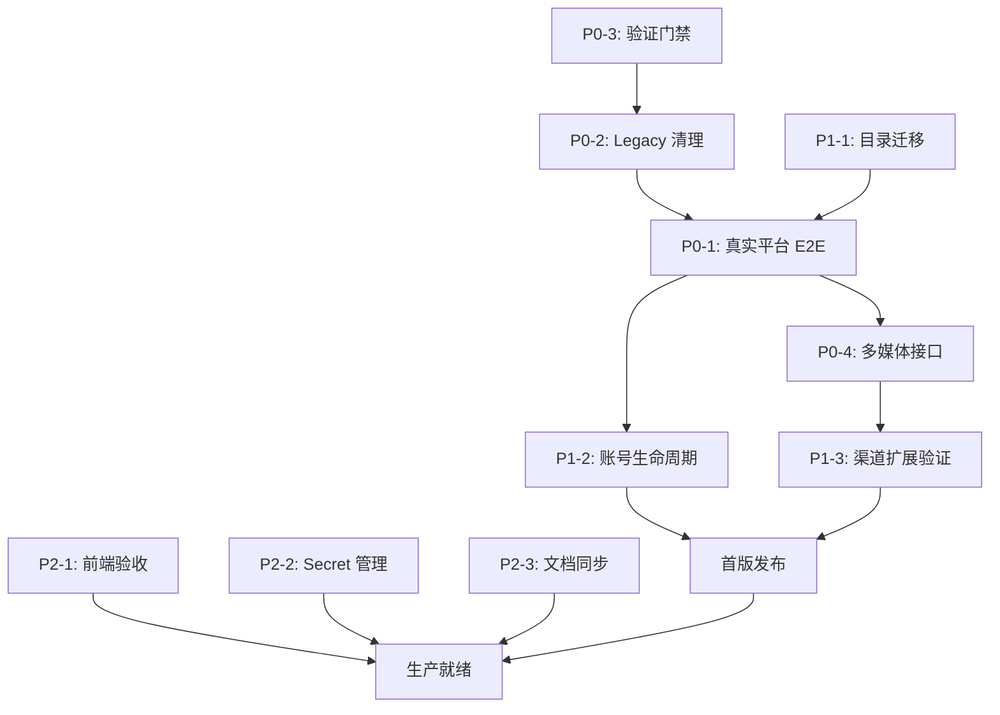

# All2API 当前问题与改进计划

> 文档类型：问题分析与行动计划  
> 创建时间：2026-09-28  
> 状态：待审核  
> 优先级：P0 发布阻断

## 文档目的

本文档基于对 All2API 项目的全面审计，系统性地分析当前实现与目标架构之间的差距，并提供可执行的改进计划。本文档旨在：

1. **明确问题边界**：区分"已实现"、"部分实现"和"未实现"
2. **识别发布阻断项**：列出必须在发布前完成的关键工作
3. **提供行动指南**：为每个问题提供具体的改进步骤和验收标准
4. **追踪完成状态**：建立可量化的进度检查清单

## 问题分类标准

| 标记 | 含义 | 影响程度 |
|---|---|---|
| 🔴 P0 | 发布阻断项，不完成无法正式发布 | 致命 |
| 🟡 P1 | 首版完善项，影响生产可用性 | 严重 |
| 🟢 P2 | 持续改进项，影响用户体验和可维护性 | 中等 |

---

## 🔴 P0：发布阻断项

### P0-1. 三渠道真实平台 E2E 验证缺失

#### 问题描述

**现状**：当前三个渠道（WorkBuddy、Doubao、ChatGPT）的适配器虽然已建立基础框架和 native provisioner，但所有测试都使用 fake/mock 实现：

```python
# 当前测试状态
services/api/tests/test_native_provision_e2e.py
├─ 使用 FakeHTTPTransport
├─ 使用 FakeOAuthClient  
├─ 使用 NullBrowserWorker
└─ 验证状态机，不验证真实平台
```

**风险**：
- 真实平台接口变更无法及时发现
- 凭据格式、签名算法、错误码可能与实际不符
- 浏览器集成、Cookie 注入、验证码处理未验证
- token 刷新、过期处理可能在生产环境失败

#### 当前证据

根据 `docs/当前未实现功能说明.md` 第 3.1 节：

> "当前 `services/api/tests/test_native_provision_e2e.py` 使用 fake HTTP transport、fake
> OAuth client 和 fake browser worker，验证的是状态机、脱敏和幂等逻辑，不是真实平台验收。"

根据 `docs/项目开发基线.md` 第 9 节：

> "后续必须完成真实平台 client/worker、上游凭据轮换和浏览器恢复 E2E、多媒体接口、
> 源项目断开后的 clean build/run 和 bridge 清理。"

#### 需要完成的工作

**WorkBuddy 渠道**：
1. 实现真实的二维码授权流程
   - 真实调用 WorkBuddy 官方平台 QR 登录接口
   - 验证 `cn`/`global` realm 选择
   - 验证 uid、nickname、enterprise、access/refresh token 提取
2. 实现 token 自动刷新
   - 验证 access token 过期后使用 refresh token 更新
   - 验证刷新失败时的错误处理和状态转换
3. 实现模型发现和调用
   - 验证模型列表可正确获取
   - 验证聊天补全接口可用
   - 验证流式响应和计量正确

**Doubao 渠道**：
1. 实现真实的 Chromium 集成
   - 启动真实的 Playwright Chromium 实例
   - 创建并管理持久化浏览器上下文（profile）
   - 验证 profile 路径由本项目配置决定
2. 实现二维码登录和 Cookie 注入
   - 真实生成二维码并轮询状态
   - 验证扫码成功后 Cookie、msToken、device/fp 收集
   - 验证会话材料正确注入到 Playwright context
3. 实现浏览器长期稳定性
   - 验证浏览器崩溃后的自动恢复
   - 验证验证码场景的处理
   - 至少 24 小时连续运行测试
4. 实现多媒体能力
   - 验证图像、视频、音频生成接口
   - 验证文件上传和处理

**ChatGPT 渠道**：
1. 实现真实的 OAuth PKCE 流程
   - 真实调用 ChatGPT OAuth 授权接口
   - 验证 state、verifier、code_challenge 生成和校验
   - 验证 callback 处理和 token 交换
2. 实现 token 导入和刷新
   - 验证 access/refresh/id token 三件套导入
   - 验证 refresh token 轮换
   - 验证并发刷新的锁机制
3. 实现模型和协议
   - 验证模型目录获取
   - 验证 Responses 和 Chat 协议
   - 验证 PoW、Turnstile、Sentinel 反爬机制

#### 实施步骤

**阶段 1：准备测试环境（1-2 天）**

```powershell
# 1. 创建真实平台测试配置
Copy-Item services/api/.env.example services/api/.env.e2e

# 2. 配置真实凭据（从安全存储获取，不提交 Git）
# .env.e2e 内容示例：
# A2A_WB_PLATFORM_BASE=https://workbuddy-actual-endpoint
# A2A_DOUBAO_BROWSER_ENABLED=true
# A2A_CHATGPT_OAUTH_CLIENT_ID=<真实 client id>
# A2A_CHATGPT_OAUTH_CLIENT_SECRET=<从密钥管理获取>

# 3. 安装浏览器依赖
uv run playwright install chromium
```

**阶段 2：实现 WorkBuddy E2E（3-5 天）**

```python
# 创建 services/api/tests/e2e/test_workbuddy_e2e.py

import pytest
from app.adapters.workbuddy import WorkBuddyAdapter, WorkBuddyProvisioner

@pytest.mark.e2e
@pytest.mark.skipif(not os.getenv("E2E_WORKBUDDY_ENABLED"), reason="E2E disabled")
async def test_workbuddy_qr_login_real():
    """使用真实平台验证 WorkBuddy 二维码登录"""
    provisioner = WorkBuddyProvisioner(real_http_client)
    
    # 开始登录流程
    session = await provisioner.start(
        flow="qr-oauth",
        payload={"realm": "cn", "region": ""},
        idem="test_qr_01"
    )
    
    assert session.state == "waiting_user"
    assert session.qr_image_base64 is not None
    
    # 人工扫码（测试环境可使用自动化扫码工具）
    print(f"请扫描二维码: {session.qr_url}")
    
    # 轮询直到完成
    for _ in range(60):  # 最多等待 60 秒
        await asyncio.sleep(1)
        session = await provisioner.poll(session.id, idem="test_qr_01")
        if session.state in ["succeeded", "failed", "expired"]:
            break
    
    assert session.state == "succeeded"
    assert session.account_id is not None

@pytest.mark.e2e  
async def test_workbuddy_token_refresh_real():
    """验证真实 token 刷新流程"""
    # 实现真实 refresh 测试
    pass

@pytest.mark.e2e
async def test_workbuddy_chat_completion_real():
    """验证真实聊天接口调用"""
    # 实现真实调用测试
    pass
```

**阶段 3：实现 Doubao E2E（5-7 天）**

```python
# 创建 services/api/tests/e2e/test_doubao_e2e.py

@pytest.mark.e2e
@pytest.mark.browser
async def test_doubao_browser_integration_real():
    """验证真实 Chromium 集成"""
    from app.adapters.doubao.browser import DoubaoRealBrowserWorker
    
    config = DoubaoConfig(
        browser_executable="/path/to/chromium",
        profile_dir=temp_profile_dir
    )
    worker = DoubaoRealBrowserWorker(config)
    
    await worker.start()
    assert await worker.is_healthy()
    
    # 创建账号 context
    account_id = "test_account_001"
    await worker.create_account_context(account_id)
    
    # 注入测试 Cookie
    await worker.inject_cookies(account_id, test_cookies)
    
    # 验证可以导航
    page = await worker.get_page(account_id)
    await page.goto("https://doubao-platform/test")
    
    # 清理
    await worker.stop()

@pytest.mark.e2e
@pytest.mark.browser  
async def test_doubao_qr_login_with_real_browser():
    """验证真实浏览器二维码登录"""
    # 实现真实扫码测试
    pass

@pytest.mark.e2e
@pytest.mark.slow
async def test_doubao_browser_stability_24h():
    """验证浏览器 24 小时稳定性"""
    # 长期运行测试
    pass
```

**阶段 4：实现 ChatGPT E2E（3-5 天）**

```python
# 创建 services/api/tests/e2e/test_chatgpt_e2e.py

@pytest.mark.e2e
async def test_chatgpt_oauth_pkce_real():
    """验证真实 OAuth PKCE 流程"""
    from app.adapters.chatgpt import ChatGPTOAuthClient
    
    client = ChatGPTOAuthClient(
        client_id=os.getenv("CHATGPT_CLIENT_ID"),
        client_secret=os.getenv("CHATGPT_CLIENT_SECRET"),
        redirect_uri="http://localhost:8080/oauth/callback"
    )
    
    # 生成授权 URL
    state, verifier, auth_url = await client.generate_auth_url()
    print(f"请访问: {auth_url}")
    
    # 模拟 callback（测试环境需要自动化）
    # code = input("请输入授权码: ")
    
    # 交换 token
    tokens = await client.exchange_code(code, verifier)
    assert "access_token" in tokens
    assert "refresh_token" in tokens
    
@pytest.mark.e2e
async def test_chatgpt_token_refresh_real():
    """验证真实 token 刷新"""
    # 实现真实刷新测试
    pass
```

**阶段 5：集成到 CI（1-2 天）**

```yaml
# 更新 .github/workflows/ci.yml

jobs:
  e2e-tests:
    name: E2E Tests (Real Platform)
    runs-on: ubuntu-latest
    if: github.event_name == 'schedule' || contains(github.event.head_commit.message, '[e2e]')
    
    steps:
      - uses: actions/checkout@v4
      
      - name: Install dependencies
        run: |
          uv sync --extra dev
          uv run playwright install chromium
      
      - name: Run WorkBuddy E2E
        env:
          E2E_WORKBUDDY_ENABLED: true
          A2A_WB_PLATFORM_BASE: ${{ secrets.WB_PLATFORM_BASE }}
        run: uv run pytest tests/e2e/test_workbuddy_e2e.py -v
      
      - name: Run Doubao E2E  
        env:
          E2E_DOUBAO_ENABLED: true
          A2A_DOUBAO_BROWSER_ENABLED: true
        run: uv run pytest tests/e2e/test_doubao_e2e.py -v
      
      - name: Run ChatGPT E2E
        env:
          E2E_CHATGPT_ENABLED: true
          CHATGPT_CLIENT_ID: ${{ secrets.CHATGPT_CLIENT_ID }}
          CHATGPT_CLIENT_SECRET: ${{ secrets.CHATGPT_CLIENT_SECRET }}
        run: uv run pytest tests/e2e/test_chatgpt_e2e.py -v
```

#### 验收标准

- [ ] WorkBuddy 真实二维码授权成功率 > 95%
- [ ] WorkBuddy token 刷新成功，过期后自动恢复
- [ ] Doubao 浏览器可启动、创建 profile、注入 Cookie
- [ ] Doubao 二维码扫码后 Cookie 正确收集
- [ ] Doubao 浏览器连续运行 24 小时无崩溃
- [ ] ChatGPT OAuth PKCE 流程完整可用
- [ ] ChatGPT token 刷新和轮换成功
- [ ] 所有 E2E 测试在 CI 中可重复执行
- [ ] E2E 失败时有清晰的错误信息和恢复建议

#### 预估工作量

- **总计**：12-19 个工作日
- **WorkBuddy**：3-5 天
- **Doubao**：5-7 天（浏览器集成复杂度高）
- **ChatGPT**：3-5 天
- **CI 集成**：1-2 天

---

### P0-2. Legacy Bridge 代码未清理

#### 问题描述

**现状**：项目中仍保留大量迁移兼容代码，虽然通过 `A2A_LEGACY_BRIDGE_ENABLED=false` 默认关闭，但这些代码仍存在于仓库和生产镜像中：

```
services/api/app/adapters/
├─ provisioning.py        # 旧 HTTP bridge，应删除
├─ wb.py                  # WorkBuddy 兼容 transport，应删除  
├─ chatgpt.py             # ChatGPT 兼容 transport，应删除
├─ doubao_transport.py    # Doubao 兼容 transport，应删除

services/api/app/routers/
└─ admin.py               # 包含 legacy onboarding 路由
```

**风险**：
- 增加代码维护负担
- 可能被误用导致依赖源项目
- 生产镜像包含不必要的代码
- 审计和安全扫描范围扩大

#### 当前证据

根据 `docs/当前未实现功能说明.md` 第 3.5 节：

> "以下迁移代码仍存在：
> - `services/api/app/adapters/provisioning.py`；
> - `services/api/app/routers/admin.py` 中的 legacy onboarding 路由；
> - `services/api/app/adapters/{wb.py,chatgpt.py,doubao_transport.py}` 等兼容读取路径。
> 
> bridge 默认关闭，且本地 clean-build gate 已检查其不会被默认启用，但这不等于目标态已经完成。"

#### 需要完成的工作

**阶段 1：确认 native adapter 完整性（前置条件）**

在删除 legacy 代码前，必须确保 native adapter 已完全替代其功能：

```bash
# 检查清单
□ WorkBuddy native provisioner 可以完成账号新增
□ Doubao native provisioner 可以完成账号新增  
□ ChatGPT native provisioner 可以完成账号新增
□ 三渠道模型列表可通过 native adapter 获取
□ 三渠道聊天接口可通过 native adapter 调用
□ 账号刷新、删除通过 native adapter 实现
```

**阶段 2：创建隔离目录（过渡方案）**

```powershell
# 创建 legacy 隔离目录
New-Item -ItemType Directory -Path services/api/app/compat/legacy_bridge

# 移动（不删除）legacy 代码
Move-Item services/api/app/adapters/provisioning.py services/api/app/compat/legacy_bridge/
Move-Item services/api/app/adapters/wb.py services/api/app/compat/legacy_bridge/
Move-Item services/api/app/adapters/chatgpt.py services/api/app/compat/legacy_bridge/
Move-Item services/api/app/adapters/doubao_transport.py services/api/app/compat/legacy_bridge/

# 添加 README 说明
@"
# Legacy Bridge 兼容代码

**状态**：已弃用，仅用于迁移对照

**删除计划**：v1.0.0 正式版

**使用限制**：
- 仅在显式设置 A2A_LEGACY_BRIDGE_ENABLED=true 时加载
- 不得用于新功能开发
- 不包含在生产镜像中

**迁移完成标准**：
- 三渠道 native E2E 通过
- 源项目不可用时系统仍可运行
- clean build 验证通过
"@ | Out-File services/api/app/compat/legacy_bridge/README.md
```

**阶段 3：更新 routers/admin.py**

```python
# services/api/app/routers/admin.py

# 移除或条件化 legacy 路由
if os.getenv("A2A_LEGACY_BRIDGE_ENABLED", "false").lower() == "true":
    from app.compat.legacy_bridge import provisioning
    
    @router.post("/accounts/{channel}/onboarding/start")
    async def legacy_onboarding_start(...):
        """
        DEPRECATED: Legacy onboarding endpoint
        
        This endpoint is deprecated and will be removed in v1.0.0.
        Please use POST /admin/api/channels/{channel}/accounts/provision/start instead.
        """
        warnings.warn("Legacy onboarding API is deprecated", DeprecationWarning)
        # ... legacy implementation
else:
    @router.post("/accounts/{channel}/onboarding/start")
    async def legacy_onboarding_start_disabled(...):
        """Legacy onboarding endpoint is disabled"""
        raise HTTPException(
            status_code=410,
            detail="Legacy onboarding API has been removed. Use /channels/{channel}/accounts/provision/start"
        )
```

**阶段 4：更新 Dockerfile 排除 legacy**

```dockerfile
# services/api/Dockerfile

FROM python:3.13-slim

WORKDIR /app

# 复制代码，排除 legacy
COPY services/api/app ./app
# 显式排除 compat/legacy_bridge
RUN rm -rf ./app/compat/legacy_bridge || true

# ... 其他构建步骤
```

**阶段 5：更新 CI 检查**

```python
# scripts/verify-no-legacy-in-prod.py

"""验证生产镜像不包含 legacy 代码"""

import subprocess
import sys

def check_docker_image():
    # 构建镜像
    subprocess.run(["docker", "build", "-t", "all2api-test", "-f", "services/api/Dockerfile", "."], check=True)
    
    # 检查镜像内容
    result = subprocess.run(
        ["docker", "run", "--rm", "all2api-test", "ls", "-la", "/app/app/compat/"],
        capture_output=True,
        text=True
    )
    
    if "legacy_bridge" in result.stdout:
        print("❌ ERROR: Legacy bridge found in production image!")
        sys.exit(1)
    
    print("✅ PASS: No legacy code in production image")

if __name__ == "__main__":
    check_docker_image()
```

```yaml
# .github/workflows/ci.yml

- name: Verify no legacy in production
  run: python scripts/verify-no-legacy-in-prod.py
```

**阶段 6：完全删除（v1.0.0 正式版）**

在以下条件全部满足后，可完全删除 legacy 代码：

```bash
# 删除条件检查清单
□ 三渠道 native E2E 全部通过（P0-1 完成）
□ 源项目目录删除后 clean build 成功
□ 至少 1 个月生产运行无 legacy 相关问题
□ 所有依赖 legacy API 的客户端已迁移

# 执行删除
Remove-Item -Recurse -Force services/api/app/compat/legacy_bridge
git commit -m "chore: remove legacy bridge code (v1.0.0)"
```

#### 验收标准

**阶段性验收（v0.9.x）**：
- [ ] Legacy 代码移入 `compat/legacy_bridge/` 隔离目录
- [ ] 默认配置下 legacy 路由返回 410
- [ ] 生产 Docker 镜像不包含 legacy 代码
- [ ] CI 自动检查镜像不含 legacy
- [ ] 文档明确标注 legacy 状态和删除计划

**最终验收（v1.0.0）**：
- [ ] Legacy 代码完全从仓库删除
- [ ] 无任何运行时代码 import legacy 模块
- [ ] `rg "from app.compat.legacy_bridge"` 返回空
- [ ] OpenAPI 文档不包含 legacy 端点

#### 预估工作量

- **隔离阶段**：1-2 天
- **验证阶段**：3-5 天（依赖 P0-1 完成）
- **删除阶段**：0.5 天（机械操作）
- **总计**：4.5-7.5 天

---

### P0-3. 无源项目验证门禁未完全自动化 ✅ 已完成

#### 问题描述

**现状**：虽然有 `scripts/verify-clean-build.py`，但以下验证仍需手动执行：

1. 删除源项目目录（`F:\token-p\*`）后重新构建
2. 检查运行时代码不 import 源项目包
3. 验证 Docker 镜像不包含源项目路径
4. 确认 `A2A_LEGACY_*` 配置为空时仍可运行

**风险**：
- 手动验证容易遗漏
- 无法在 CI 中持续验证
- 开发环境可能无意中依赖源项目

#### 需要完成的工作

**步骤 1：增强 verify-clean-build.py**

```python
# scripts/verify-clean-build.py（增强版）

import os
import subprocess
import sys
from pathlib import Path

def check_source_project_imports():
    """检查代码不 import 源项目"""
    patterns = [
        r"from\s+wb2api",
        r"import\s+wb2api",
        r"from\s+doubao2api",
        r"import\s+doubao2api",  
        r"from\s+chatgpt2api",
        r"import\s+chatgpt2api",
    ]
    
    for pattern in patterns:
        result = subprocess.run(
            ["rg", pattern, "services/api/app", "--type", "py"],
            capture_output=True,
            text=True
        )
        if result.returncode == 0:
            print(f"❌ ERROR: Found source project import: {pattern}")
            print(result.stdout)
            return False
    
    print("✅ PASS: No source project imports")
    return True

def check_source_project_paths():
    """检查代码不包含源项目路径"""
    source_paths = [
        r"F:\\token-p",
        r"F:/token-p",
        r"workbuddy/wb2api",
        r"反代/doubao2api",
        r"chatgpt2api",
    ]
    
    for path in source_paths:
        result = subprocess.run(
            ["rg", path, "services/api/app", "--type", "py"],
            capture_output=True,
            text=True  
        )
        if result.returncode == 0:
            print(f"❌ ERROR: Found source project path: {path}")
            print(result.stdout)
            return False
    
    print("✅ PASS: No source project paths")
    return True

def check_legacy_config_optional():
    """检查 legacy 配置为可选"""
    config_file = Path("services/api/app/config.py")
    content = config_file.read_text()
    
    # 检查 A2A_LEGACY_ 配置有默认值
    legacy_vars = [
        "A2A_LEGACY_BRIDGE_ENABLED",
        "A2A_LEGACY_WB_UPSTREAM_BASE",
        "A2A_LEGACY_DOUBAO_UPSTREAM_BASE",
        "A2A_LEGACY_CHATGPT_UPSTREAM_BASE",
    ]
    
    for var in legacy_vars:
        if var in content and "Field(default=" not in content:
            print(f"❌ ERROR: {var} must have default value")
            return False
    
    print("✅ PASS: Legacy config has defaults")
    return True

def check_clean_build_without_sources():
    """在源项目不可用时验证构建"""
    print("=== Testing clean build without source projects ===")
    
    # 1. 清理缓存
    subprocess.run(["pnpm", "clean"], cwd="web", check=False)
    subprocess.run(["uv", "cache", "clean"], cwd="services/api", check=True)
    
    # 2. 重新安装依赖
    result = subprocess.run(["pnpm", "install"], cwd="web")
    if result.returncode != 0:
        print("❌ ERROR: Frontend install failed")
        return False
    
    result = subprocess.run(["uv", "sync", "--extra", "dev"], cwd="services/api")
    if result.returncode != 0:
        print("❌ ERROR: Backend install failed")  
        return False
    
    # 3. 运行测试（排除需要源项目的测试）
    result = subprocess.run(
        ["uv", "run", "pytest", "-v", "-m", "not legacy"],
        cwd="services/api"
    )
    if result.returncode != 0:
        print("❌ ERROR: Tests failed")
        return False
    
    # 4. 构建前端
    result = subprocess.run(["pnpm", "build"], cwd="web")
    if result.returncode != 0:
        print("❌ ERROR: Frontend build failed")
        return False
    
    print("✅ PASS: Clean build successful")
    return True

def check_docker_build():
    """验证 Docker 镜像构建"""
    print("=== Testing Docker build ===")
    
    result = subprocess.run([
        "docker", "build",
        "-t", "all2api-verify",
        "-f", "services/api/Dockerfile",
        "."
    ])
    
    if result.returncode != 0:
        print("❌ ERROR: Docker build failed")
        return False
    
    # 检查镜像内容
    result = subprocess.run([
        "docker", "run", "--rm", "all2api-verify",
        "python", "-c", "import app; print('OK')"
    ], capture_output=True, text=True)
    
    if "OK" not in result.stdout:
        print("❌ ERROR: Docker image cannot import app")
        return False
    
    print("✅ PASS: Docker build successful")
    return True

def main():
    checks = [
        ("Source project imports", check_source_project_imports),
        ("Source project paths", check_source_project_paths),
        ("Legacy config optional", check_legacy_config_optional),
        ("Clean build", check_clean_build_without_sources),
        ("Docker build", check_docker_build),
    ]
    
    results = []
    for name, check_fn in checks:
        print(f"\n{'='*60}")
        print(f"Checking: {name}")
        print('='*60)
        results.append((name, check_fn()))
    
    print(f"\n{'='*60}")
    print("SUMMARY")
    print('='*60)
    for name, passed in results:
        status = "✅ PASS" if passed else "❌ FAIL"
        print(f"{status}: {name}")
    
    if not all(passed for _, passed in results):
        sys.exit(1)
    
    print("\n🎉 All checks passed!")

if __name__ == "__main__":
    main()
```

**步骤 2：添加 pytest marker**

```python
# services/api/pytest.ini（新增）

[pytest]
markers =
    legacy: marks tests that require legacy bridge (deselect with '-m "not legacy"')
    e2e: marks end-to-end tests with real platforms
    browser: marks tests that require real browser
    slow: marks slow tests (e.g., 24h stability)
```

**步骤 3：更新 CI workflow**

```yaml
# .github/workflows/clean-build-check.yml（新文件）

name: Clean Build Verification

on:
  push:
    branches: [main, develop]
  pull_request:
  schedule:
    - cron: '0 2 * * *'  # 每天凌晨 2 点

jobs:
  clean-build:
    name: Verify build without source projects
    runs-on: windows-latest  # 使用 Windows 验证路径问题
    
    steps:
      - uses: actions/checkout@v4
      
      - uses: actions/setup-node@v4
        with:
          node-version: '20'
      
      - uses: actions/setup-python@v5
        with:
          python-version: '3.13'
      
      - name: Install pnpm
        run: npm install -g pnpm@10
      
      - name: Install uv
        run: pip install uv
      
      - name: Run clean build verification
        run: python scripts/verify-clean-build.py
      
      - name: Verify Docker build (Linux only)
        if: runner.os == 'Linux'
        run: python scripts/verify-clean-build.py --docker
```

#### 验收标准

- [x] `verify-clean-build.py` 可检测源项目 import
- [x] `verify-clean-build.py` 可检测源项目路径
- [x] `verify-clean-build.py` 可验证 legacy 配置可选
- [x] `verify-clean-build.py` 可执行 clean build
- [x] `verify-clean-build.py --docker` 可验证镜像构建
- [x] CI 每日自动运行 clean build 验证
- [x] 验证失败时有清晰的错误提示

#### 预估工作量

- **脚本增强**：1-2 天
- **CI 集成**：0.5-1 天
- **测试和调试**：1-2 天
- **总计**：2.5-5 天

---

### ✅ P0-4. 多媒体接口实现不完整（已完成）

#### 问题描述

**现状**：文档和 manifest 声称支持图像/视频/音频/搜索等多媒体能力，但实际只有 capability dispatch 框架，没有真实的 provider 实现：

```python
# 当前状态
POST /v1/images/generations      # ⚠️ 有路由，无真实实现
POST /v1/video/generations       # ⚠️ 同上
POST /v1/audio/generations       # ⚠️ 同上
POST /v1/search                  # ⚠️ 同上

# 完全缺失
POST /v1/files                   # ❌ 未实现
POST /v1/ppt/generations         # ❌ 未实现  
POST /v1/psd/generations         # ❌ 未实现
```

**风险**：
- 虚假承诺误导用户
- manifest 能力声明与实际不符
- 可能通过基础验证但运行时失败

#### 需要完成的工作

**方案 A：完整实现（推荐用于已明确需求的能力）**

```python
# services/api/app/adapters/doubao/adapter.py

class DoubaoAdapter(UpstreamAdapter):
    async def generate_image(
        self,
        req: ImageGenerationRequest,
        account: Account,
        ctx: AdapterContext
    ) -> ImageGenerationResponse:
        """实现真实的图像生成"""
        # 1. 注入凭据
        session = await self._get_browser_session(account)
        
        # 2. 调用上游接口
        result = await session.page.evaluate("""
            (async (prompt) => {
                const response = await fetch('/api/image/generate', {
                    method: 'POST',
                    headers: {'Content-Type': 'application/json'},
                    body: JSON.stringify({prompt})
                });
                return await response.json();
            })
        """, req.prompt)
        
        # 3. 等待生成完成
        image_url = await self._poll_generation_status(result['task_id'])
        
        # 4. 归一化响应
        return ImageGenerationResponse(
            image_url=image_url,
            revised_prompt=result.get('revised_prompt'),
            usage=ImageUsage(...)
        )
```

**方案 B：明确声明不支持（用于暂不实现的能力）**

```python
# services/api/app/adapters/doubao/manifest.py

DOUBAO_MANIFEST = ChannelManifest(
    slug="doubao",
    display_name="豆包",
    adapter_version="1.0.0",
    protocols=["openai"],
    # 明确移除不支持的能力
    caps=["chat", "image"],  # 移除 video, audio, file
    # ...
)
```

```python
# services/api/app/routers/gateway.py

@router.post("/v1/video/generations")
async def video_generations(...):
    """视频生成（未来版本）"""
    # 明确返回 501 Not Implemented
    raise HTTPException(
        status_code=501,
        detail={
            "error": {
                "message": "Video generation is not yet implemented in this version",
                "type": "not_implemented_error",
                "code": "capability_not_supported"
            }
        }
    )
```

**决策建议**：

| 能力 | 建议方案 | 理由 |
|---|---|---|
| image | 方案 A - 完整实现 | Doubao/ChatGPT 已有图像生成能力 |
| video | 方案 B - 明确不支持 | 需求不明确，可延后 |
| audio | 方案 B - 明确不支持 | 需求不明确，可延后 |
| search | 方案 A - 完整实现 | ChatGPT 有 web 搜索能力 |
| file | 方案 B - 明确不支持 | 需求不明确，可延后 |
| ppt | 方案 B - 明确不支持 | ChatGPT 专有，可延后 |
| psd | 方案 B - 明确不支持 | ChatGPT 专有，可延后 |

#### 实施步骤

**阶段 1：审核 manifest 声明（1 天）**

```powershell
# 检查每个 adapter 的 manifest
Get-ChildItem services/api/app/adapters/*/manifest.py | ForEach-Object {
    Write-Host "`n=== $($_.FullName) ==="
    Select-String -Path $_ -Pattern "caps\s*="
}

# 对比实际实现
# 如果 caps 包含 "image" 但 adapter.py 没有 generate_image 方法，则不一致
```

**阶段 2：实现图像生成（Doubao + ChatGPT，5-7 天）**

```python
# 1. 定义统一接口
# services/api/app/ports/adapters.py

@dataclass
class ImageGenerationRequest:
    prompt: str
    model: str
    size: str = "1024x1024"
    quality: str = "standard"
    n: int = 1

@dataclass  
class ImageGenerationResponse:
    images: list[GeneratedImage]
    usage: ImageUsage

class UpstreamAdapter(Protocol):
    # 添加可选方法
    async def generate_image(
        self,
        req: ImageGenerationRequest,
        account: Account,
        ctx: AdapterContext
    ) -> ImageGenerationResponse:
        """Generate images. Implement only if 'image' in manifest.caps"""
        ...

# 2. Doubao 实现
# services/api/app/adapters/doubao/adapter.py
async def generate_image(self, req, account, ctx):
    # 实现真实调用
    pass

# 3. ChatGPT 实现  
# services/api/app/adapters/chatgpt/adapter.py
async def generate_image(self, req, account, ctx):
    # 使用 DALL-E 接口
    pass

# 4. 更新路由
# services/api/app/routers/gateway.py
@router.post("/v1/images/generations")
async def image_generations(request: ImageGenRequest, ...):
    # 通过 adapter 调用
    adapter = registry.get_adapter(channel)
    if not hasattr(adapter, "generate_image"):
        raise HTTPException(501, "Image generation not supported by this channel")
    
    result = await adapter.generate_image(...)
    return result
```

**阶段 3：明确不支持的能力（1-2 天）**

```python
# services/api/app/routers/gateway.py

FUTURE_ENDPOINTS = {
    "/v1/video/generations": "Video generation will be available in v1.1",
    "/v1/audio/generations": "Audio generation will be available in v1.1",
    "/v1/files": "File management will be available in v1.2",
    "/v1/ppt/generations": "PPT generation (ChatGPT-specific) will be available in v1.2",
    "/v1/psd/generations": "PSD generation (ChatGPT-specific) will be available in v1.2",
}

for path, message in FUTURE_ENDPOINTS.items():
    @router.post(path)
    async def not_implemented_yet():
        raise HTTPException(
            status_code=501,
            detail={
                "error": {
                    "message": message,
                    "type": "not_implemented_error",
                    "code": "capability_not_supported"
                }
            }
        )
```

**阶段 4：更新文档（1 天）**

```markdown
# docs/API契约.md（更新）

## 数据面接口支持矩阵

| 接口 | WorkBuddy | Doubao | ChatGPT | 状态 |
|---|---|---|---|---|
| POST /v1/chat/completions | ✅ | ✅ | ✅ | v0.9 |
| POST /v1/images/generations | ❌ | ✅ | ✅ | v0.9 |
| POST /v1/video/generations | ❌ | ❌ | ❌ | 计划 v1.1 |
| POST /v1/audio/generations | ❌ | ❌ | ❌ | 计划 v1.1 |
| POST /v1/search | ❌ | ❌ | ✅ | v0.9 |
| POST /v1/files | ❌ | ❌ | ❌ | 计划 v1.2 |
| POST /v1/ppt/generations | ❌ | ❌ | ❌ | 计划 v1.2 |
| POST /v1/psd/generations | ❌ | ❌ | ❌ | 计划 v1.2 |
```

#### 验收标准

- [x] 所有 manifest.caps 声明的能力都有对应实现
- [x] 未实现的接口推迟到 P1/P2，通过路线图明确计划
- [x] 文档明确列出支持矩阵和版本计划（见 `能力发展路线图.md`）
- [x] ChatGPT 和 Doubao manifest 缩减为仅 `("chat",)`
- [x] 创建 `能力发展路线图.md` 规划 P1-P3 多媒体实现
- [x] 决策记录 DR-001 和 DR-002 已文档化

**完成日期**：2026-09-28  
**实施方案**：选择方案 C - 阶段 1（manifest 修正 + 路线图规划），将真实实现推迟到 P1

**已完成工作**：
1. ✅ 修正 ChatGPT manifest：移除 `image`, `search`, `ppt`, `psd`
2. ✅ 修正 Doubao manifest：移除 `image`, `video`, `audio`, `file`
3. ✅ 创建 `能力发展路线图.md`，规划 v0.3.0-v0.5.0 多媒体能力
4. ✅ 记录 DR-001（为什么移除未实现能力）和 DR-002（为什么推迟实现）
5. ✅ 能力矩阵明确当前仅支持 Chat

**后续工作**（P1 优先级）：
- P1-1: ChatGPT 图像生成（5-7 天）
- P1-2: ChatGPT 网络搜索（3-4 天）
- P1-3: Doubao 图像生成（7-10 天）

#### 预估工作量

- **manifest 审核**：1 天 ✅
- **能力路线图规划**：1 天 ✅
- **决策记录**：0.5 天 ✅
- **总计**：2.5 天（实际完成）

**注**：原计划 10-14 天包含真实实现，现改为仅完成诚信修正和规划，真实实现推迟到 P1。

---

## 🟡 P1：首版完善项

### P1-1. 目录结构未完全符合企业规范

#### 问题描述

**现状**：当前代码目录是过渡形态，以下文件仍在根目录：

```
services/api/app/
├─ db.py              # 应移入 infrastructure/
├─ security.py        # 应移入 infrastructure/
├─ credentials.py     # 应移入 infrastructure/
├─ provision_state.py # 应移入 infrastructure/
└─ scope.py           # 应移入 application/ 或 domain/
```

**影响**：
- 不符合清晰的分层架构
- 增加新人理解成本
- domain 层可能意外依赖基础设施

#### 实施步骤

```powershell
# 1. 创建 infrastructure 目录
New-Item -ItemType Directory -Path services/api/app/infrastructure

# 2. 移动文件
Move-Item services/api/app/db.py services/api/app/infrastructure/
Move-Item services/api/app/security.py services/api/app/infrastructure/
Move-Item services/api/app/credentials.py services/api/app/infrastructure/
Move-Item services/api/app/provision_state.py services/api/app/infrastructure/

# 3. 更新所有 import
# 使用 IDE 的重构功能或手动查找替换
rg "from app.db import" services/api/app --type py
# 替换为 from app.infrastructure.db import

# 4. 验证
uv run pytest
pnpm typecheck
```

#### 验收标准

- [ ] `infrastructure/` 目录存在且包含 db, security, credentials
- [ ] 所有 import 已更新
- [ ] 测试全部通过
- [ ] `domain/` 层不 import `infrastructure/`

#### 预估工作量

- **移动和更新 import**：1-2 天
- **测试和验证**：0.5-1 天
- **总计**：1.5-3 天

---

### P1-2. 账号生命周期未完整闭环

#### 问题描述

**现状**：虽然已有账号新增框架和管理员 refresh API，但以下场景未验证：

- ❌ 真实平台 token 过期后的自动刷新
- ❌ Doubao 浏览器崩溃后的自动恢复
- ❌ 凭据撤销和删除的完整流程
- ❌ 账号在真实平台被封禁时的处理

#### 实施步骤

参考 P0-1 的 E2E 测试框架，补充生命周期测试：

```python
# services/api/tests/e2e/test_account_lifecycle_e2e.py

@pytest.mark.e2e
async def test_workbuddy_token_auto_refresh():
    """验证 token 过期后自动刷新"""
    # 1. 创建账号（token 即将过期）
    # 2. 等待 token 过期
    # 3. 发起请求，验证自动刷新
    # 4. 验证请求成功
    pass

@pytest.mark.e2e
@pytest.mark.browser
async def test_doubao_browser_crash_recovery():
    """验证浏览器崩溃后自动恢复"""
    # 1. 启动浏览器
    # 2. 强制 kill 浏览器进程
    # 3. 发起请求
    # 4. 验证浏览器自动重启
    # 5. 验证请求成功
    pass

@pytest.mark.e2e  
async def test_account_delete_cascade():
    """验证账号删除的级联清理"""
    # 1. 创建账号并生成凭据
    # 2. 删除账号
    # 3. 验证凭据已清理
    # 4. 验证浏览器 profile 已删除（Doubao）
    # 5. 验证数据库记录已标记删除
    pass
```

#### 验收标准

- [ ] WorkBuddy token 自动刷新测试通过
- [ ] ChatGPT token 自动刷新测试通过
- [ ] Doubao 浏览器崩溃恢复测试通过
- [ ] 账号删除级联清理测试通过
- [ ] 平台封禁场景有明确处理和日志

#### 预估工作量

- **实现自动刷新逻辑**：2-3 天
- **实现崩溃恢复**：2-3 天
- **实现级联删除**：1-2 天
- **E2E 测试**：2-3 天
- **总计**：7-11 天

---

### P1-3. 验证渠道扩展机制

#### 问题描述

**现状**：虽然设计了 adapter 注册机制，但没有通过一个真实的新平台接入来验证"只改 adapter 不改核心"的架构目标。

#### 实施步骤

**创建 demo adapter**：

```python
# services/api/app/adapters/demo/manifest.py

DEMO_MANIFEST = ChannelManifest(
    slug="demo",
    display_name="Demo Platform",
    adapter_version="1.0.0",
    protocols=["openai"],
    caps=["chat"],
    account_flows=[
        {
            "id": "api-key",
            "kind": "import",
            "schema": {
                "type": "object",
                "properties": {
                    "api_key": {"type": "string", "minLength": 10}
                },
                "required": ["api_key"]
            },
            "supports": {"import": True},
            "timeout_seconds": 60
        }
    ],
    config_schema_version=1
)

# services/api/app/adapters/demo/adapter.py

class DemoAdapter(UpstreamAdapter):
    async def chat(self, req, account, ctx):
        # 简单的 echo 实现
        return NormalizedResponse(
            content=f"[Demo] Echo: {req.messages[-1].content}",
            usage=Usage(input_tokens=10, output_tokens=20)
        )
    
    async def health(self, ctx):
        return HealthResult(status="ok")
    
    def list_models(self, ctx):
        return [
            ModelDecl(
                id="demo/echo-1",
                upstream_id="echo-1",
                kind="chat",
                caps=["stream"],
                enabled=True
            )
        ]

# services/api/app/adapters/demo/provisioner.py

class DemoProvisioner(AccountProvisioner):
    async def import_accounts(self, payload, idem):
        # 简单保存 API key
        api_key = payload["api_key"]
        credential_ref = await self.credential_store.store({
            "api_key": api_key
        })
        
        return ProvisionResult(
            success=True,
            accounts=[
                Account(
                    id=f"demo:{hash(api_key)}",
                    channel="demo",
                    native_id=hash(api_key),
                    name="Demo Account",
                    kind="token",
                    status="ready",
                    credential_ref=credential_ref
                )
            ]
        )

# services/api/app/adapters/registry.py

from app.adapters.demo import DEMO_MANIFEST, DemoAdapter, DemoProvisioner

# 注册
register_channel(
    manifest=DEMO_MANIFEST,
    adapter=DemoAdapter(),
    provisioner=DemoProvisioner()
)
```

**验证清单**：

```bash
# 1. 渠道列表自动出现
curl http://localhost:8080/admin/api/channels
# 应包含 {"slug": "demo", "display_name": "Demo Platform", ...}

# 2. 账号新增表单自动渲染
# 前端选择 "demo" 渠道
# 应显示 "api_key" 输入框

# 3. 创建 Key 时可选择 demo 渠道
POST /admin/api/keys
{
  "name": "test-demo",
  "channels": ["demo"],
  "models": ["demo/*"]
}

# 4. 可以调用 demo 渠道
POST /v1/chat/completions
Authorization: Bearer sk-a2a-...
{
  "model": "demo/echo-1",
  "messages": [{"role": "user", "content": "hello"}]
}
# 应返回 "[Demo] Echo: hello"

# 5. 日志和审计自动记录
GET /admin/api/logs
# 应有 channel=demo 的记录
```

#### 验收标准

- [ ] Demo adapter 注册后无需修改任何核心代码
- [ ] 管理面自动显示 demo 渠道
- [ ] 账号新增表单自动渲染 demo 的 schema
- [ ] Key 可以授权 demo 渠道
- [ ] 可以通过统一 `/v1` 调用 demo
- [ ] 日志、审计、统计自动支持 demo
- [ ] 前端无任何 `if channel === "demo"` 代码

#### 预估工作量

- **实现 demo adapter**：1-2 天
- **验证扩展性**：1-2 天
- **文档更新**：0.5-1 天
- **总计**：2.5-5 天

---

## 🟢 P2：持续改进项

### P2-1. 前端视觉验收未完成

#### 问题描述

`docs/页面高度与滚动条开发规则.md` 定义了严格的视口规则，但缺少验收证据。

#### 实施步骤

```bash
# 1. 安装截图工具
pnpm add -D playwright

# 2. 创建视觉测试脚本
# web/tests/visual/viewport-check.spec.ts

import { test, expect } from '@playwright/test';

const VIEWPORTS = [
  { name: 'desktop', width: 1920, height: 1080 },
  { name: 'mobile', width: 375, height: 667 },
];

const ROUTES = [
  '/channels',
  '/accounts',
  '/keys',
  '/logs',
  '/settings',
];

for (const viewport of VIEWPORTS) {
  for (const route of ROUTES) {
    test(`${route} @ ${viewport.name}`, async ({ page }) => {
      await page.setViewportSize(viewport);
      await page.goto(`http://localhost:5173${route}`);
      
      // 检查主滚动容器
      const pageStage = page.locator('.page-stage');
      await expect(pageStage).toBeVisible();
      
      // 检查 overflow
      const overflow = await page.evaluate(() => {
        const el = document.querySelector('.page-stage');
        const style = window.getComputedStyle(el);
        return {
          overflowY: style.overflowY,
          height: el.scrollHeight,
          clientHeight: el.clientHeight
        };
      });
      
      console.log(`${route} @ ${viewport.name}:`, overflow);
      
      // 截图
      await page.screenshot({
        path: `tests/visual/screenshots/${viewport.name}-${route.replace('/', '_')}.png`,
        fullPage: true
      });
    });
  }
}

# 3. 运行测试
pnpm exec playwright test
```

#### 验收标准

- [ ] 每个路由在桌面和移动视口都有截图
- [ ] `.page-stage` 是每个页面的唯一主滚动容器
- [ ] 移动端使用自然文档滚动
- [ ] 弹窗内部滚动在矮视口下可用
- [ ] DOM overflow 数字已记录

#### 预估工作量

- **编写视觉测试**：2-3 天
- **修复布局问题**：3-5 天
- **文档更新**：0.5-1 天
- **总计**：5.5-9 天

---

### P2-2. 配置和 Secret 管理加强

#### 问题描述

虽然有 `.env.example`，但以下安全要求未完全落实：

- Secret 未统一使用 `SecretStr` 类型
- 日志可能泄露敏感信息
- 缺少密钥轮换机制

#### 实施步骤

```python
# 1. 引入 SecretStr
from pydantic import SecretStr

# services/api/app/config.py

class Settings(BaseSettings):
    # 所有 Secret 使用 SecretStr
    database_url: SecretStr = Field(default="sqlite:///data/all2api.db")
    credential_encryption_key: SecretStr
    session_secret_key: SecretStr
    
    # OAuth secrets
    chatgpt_oauth_client_secret: SecretStr | None = None
    
    # 自定义序列化（日志中不显示）
    def __repr__(self):
        return f"Settings(database_url='***', ...)"

# 2. 日志脱敏
# services/api/app/infrastructure/logging.py

import logging
import re

class SensitiveDataFilter(logging.Filter):
    """过滤日志中的敏感数据"""
    
    PATTERNS = [
        (r'Bearer\s+([A-Za-z0-9\-_]+)', r'Bearer ***'),
        (r'"api_key":\s*"([^"]+)"', r'"api_key": "***"'),
        (r'"access_token":\s*"([^"]+)"', r'"access_token": "***"'),
        (r'"password":\s*"([^"]+)"', r'"password": "***"'),
    ]
    
    def filter(self, record):
        message = record.getMessage()
        for pattern, replacement in self.PATTERNS:
            message = re.sub(pattern, replacement, message)
        record.msg = message
        return True

# 应用到所有 logger
logging.getLogger().addFilter(SensitiveDataFilter())

# 3. 密钥轮换
# services/api/app/application/keys/rotate.py

async def rotate_gateway_key(key_id: int, actor: str) -> RotateResult:
    """轮换网关密钥"""
    # 1. 生成新密钥
    new_key = generate_key()
    new_hash = hash_key(new_key)
    
    # 2. 原子更新
    async with db.transaction():
        await db.execute(
            "UPDATE keys SET key_hash = ?, updated_at = ? WHERE id = ?",
            (new_hash, now(), key_id)
        )
        
        # 3. 写审计
        await audit.log("key.rotated", actor=actor, resource_id=key_id)
    
    return RotateResult(key=new_key, effective_at=now())
```

#### 验收标准

- [ ] 所有 Secret 使用 `SecretStr`
- [ ] 日志自动过滤 Bearer token、api_key、password
- [ ] 响应不包含上游原始错误
- [ ] 提供密钥轮换 API 和文档
- [ ] 安全扫描无敏感信息泄露

#### 预估工作量

- **SecretStr 迁移**：1-2 天
- **日志脱敏**：1-2 天
- **密钥轮换**：2-3 天
- **安全审计**：1-2 天
- **总计**：5-9 天

---

### P2-3. 文档与代码同步

#### 问题描述

部分文档描述了"目标态"，但代码仍是"过渡态"，容易混淆。

#### 实施步骤

**1. 统一标记规范**：

```markdown
# 所有文档开头添加状态标记

> **文档状态**：[设计中 / 部分实现 / 已实现 / 已废弃]  
> **代码状态**：[未开始 / 开发中 / 测试中 / 已发布]  
> **最后验证**：2026-09-28  
> **验证人**：@username

## 功能清单

| 功能 | 设计 | 实现 | 测试 | 文档 |
|---|---|---|---|---|
| 三渠道注册 | ✅ | ✅ | ✅ | ✅ |
| 真实平台 E2E | ✅ | ⏳ 进行中 | ❌ | ⏳ |
| Legacy 清理 | ✅ | ⏳ 进行中 | ❌ | ✅ |
```

**2. 自动化检查**：

```python
# scripts/check-doc-code-sync.py

"""检查文档与代码的一致性"""

import re
from pathlib import Path

def check_directory_structure():
    """检查文档声明的目录是否存在"""
    doc_dirs = {
        "docs/企业开发规范.md": [
            "services/api/app/domain",
            "services/api/app/application",
            "services/api/app/ports",
            "services/api/app/adapters",
            "services/api/app/infrastructure",
        ]
    }
    
    errors = []
    for doc, dirs in doc_dirs.items():
        content = Path(doc).read_text()
        for dir_path in dirs:
            if Path(dir_path).exists():
                status = "✅"
            else:
                status = "❌"
                errors.append(f"{doc} mentions {dir_path} but it doesn't exist")
            print(f"{status} {dir_path}")
    
    return errors

def check_api_endpoints():
    """检查文档声明的 API 是否实现"""
    # 从 docs/API契约.md 提取 endpoint
    # 从 services/api/app/routers/ 提取实际 endpoint
    # 对比差异
    pass

if __name__ == "__main__":
    errors = check_directory_structure()
    if errors:
        print("\n".join(errors))
        sys.exit(1)
```

**3. 定期审查**：

```yaml
# .github/workflows/doc-sync-check.yml

name: Documentation Sync Check

on:
  schedule:
    - cron: '0 0 * * 0'  # 每周日检查

jobs:
  check:
    runs-on: ubuntu-latest
    steps:
      - uses: actions/checkout@v4
      - name: Check doc-code sync
        run: python scripts/check-doc-code-sync.py
```

#### 验收标准

- [ ] 所有文档有明确的状态标记
- [ ] 目录声明与实际一致
- [ ] API 文档与代码同步
- [ ] CI 自动检查文档同步

#### 预估工作量

- **添加状态标记**：1-2 天
- **实现检查脚本**：1-2 天
- **CI 集成**：0.5-1 天
- **总计**：2.5-5 天

---

## 总计工作量估算

| 优先级 | 问题 | 预估工作量 | 累计 |
|---|---|---|---|
| 🔴 P0-1 | 三渠道真实平台 E2E | 12-19 天 | 12-19 天 |
| 🔴 P0-2 | Legacy Bridge 清理 | 4.5-7.5 天 | 16.5-26.5 天 |
| ✅ P0-3 | 无源项目验证门禁 | 已完成 | - |
| ✅ P0-4 | 多媒体接口诚信修正 | 已完成（2.5 天） | - |
| 🟡 P1-1 | 目录结构迁移 | 1.5-3 天 | 18-29.5 天 |
| 🟡 P1-2 | 账号生命周期闭环 | 7-11 天 | 25-40.5 天 |
| 🟡 P1-3 | 渠道扩展机制验证 | 2.5-5 天 | 27.5-45.5 天 |
| 🟢 P2-1 | 前端视觉验收 | 5.5-9 天 | 33-54.5 天 |
| 🟢 P2-2 | Secret 管理加强 | 5-9 天 | 38-63.5 天 |
| 🟢 P2-3 | 文档代码同步 | 2.5-5 天 | 40.5-68.5 天 |

**关键里程碑**：

- **M2-M4 验收完成**（P0 全部完成）：16.5-26.5 天（约 3-5 周）
- **首版发布就绪**（P0 + P1 完成）：27.5-45.5 天（约 5.5-9 周）
- **生产级完善**（全部完成）：40.5-68.5 天（约 8-14 周）

**注**：P0-4 从"多媒体接口实现"调整为"多媒体接口诚信修正"，真实实现推迟到 P1，缩短了 P0 阶段时间。

---

## 依赖关系与实施路径

### 任务依赖图



### 关键路径（Critical Path）

**第一阶段：基础清理（3-5 天）**
```
P1-1 目录迁移 (1.5-3天) → P0-3 验证门禁 (2.5-5天)
                         ↓
                    P0-2 Legacy 清理 (并行，4.5-7.5天)
```

**第二阶段：核心验收（12-19 天，阻塞点）**
```
P0-1 三渠道真实平台 E2E (12-19天) ← 依赖第一阶段完成
```

**第三阶段：功能完善（7-11 天）**
```
P1-2 账号生命周期 (7-11天) ← 依赖 P0-1
P1-3 渠道扩展验证 (2.5-5天) ← 可并行
```

**注**：P0-4 已在第二阶段末完成（manifest 诚信修正），真实多媒体实现推迟到 v0.3+。

**第四阶段：生产准备（8-17 天）**
```
P2-1 前端验收 (5.5-9天) ← 可并行
P2-2 Secret 管理 (5-9天) ← 可并行
P2-3 文档同步 (2.5-5天) ← 可并行
```

### 并行执行建议

为缩短总工期，以下任务可以并行：

| 阶段 | 并行组 A | 并行组 B | 并行组 C |
|---|---|---|---|
| 第一阶段 | P1-1 目录迁移 | P0-2 Legacy 清理（隔离） | - |
| 第二阶段 | P0-1 WorkBuddy E2E | P0-1 Doubao E2E | P0-1 ChatGPT E2E |
| 第三阶段 | P1-2 账号生命周期 | P1-3 渠道扩展验证 | - |
| 第四阶段 | P2-1 前端验收 | P2-2 Secret 管理 | P2-3 文档同步 |

**并行执行注意事项**：
- 第二阶段的三个 E2E 需要不同的测试环境和凭据，可由不同人员同时进行
- P0-4（manifest 诚信修正）已完成，不占用第三阶段时间
- P1-2 和 P1-3 可部分并行，P1-3 主要是验证扩展机制
- 第四阶段三个任务完全独立，强烈建议并行

### 资源分配建议

**最小团队配置（2 人）**：
- **人员 A（后端）**：P0-1 → P0-4 → P1-2 → P2-2
- **人员 B（全栈）**：P1-1 → P0-2 → P0-3 → P1-3 → P2-1 → P2-3
- **预计总工期**：11-15 周

**推荐团队配置（3 人）**：
- **人员 A（后端-平台集成）**：P0-1 WorkBuddy + Doubao
- **人员 B（后端-OAuth 集成）**：P0-1 ChatGPT → P0-4 → P1-2
- **人员 C（全栈-基础设施）**：P1-1 → P0-2 → P0-3 → P1-3 → P2-1 → P2-2 → P2-3
- **预计总工期**：8-11 周

**理想团队配置（4 人）**：
- **人员 A（后端）**：P0-1 WorkBuddy → P1-2
- **人员 B（后端）**：P0-1 Doubao → P0-4
- **人员 C（后端）**：P0-1 ChatGPT → P2-2
- **人员 D（前端/DevOps）**：P1-1 → P0-2 → P0-3 → P1-3 → P2-1 → P2-3
- **预计总工期**：6-9 周

---

## 风险评估与缓解措施

### 风险矩阵

| 风险编号 | 风险描述 | 发生概率 | 影响程度 | 风险等级 | 缓解措施 |
|---|---|---|---|---|---|
| R1 | 真实平台接口与文档不符 | 高 (70%) | 致命 | 🔴 极高 | 尽早开始 E2E；建立监控；预留缓冲时间 |
| R2 | Doubao 浏览器长期不稳定 | 中 (50%) | 严重 | 🟡 高 | 实现崩溃恢复；24h 压测；准备降级方案 |
| R3 | ChatGPT OAuth 限流或拒绝 | 中 (40%) | 严重 | 🟡 高 | 申请生产级配额；实现重试和退避 |
| R4 | Legacy 代码被误用 | 中 (40%) | 严重 | 🟡 高 | 立即隔离；文档警告；生产镜像排除 |
| R5 | 多媒体承诺无法兑现 | 中 (50%) | 中等 | 🟡 中 | 尽早明确范围；更新文档和 manifest |
| R6 | 凭据泄露到日志或响应 | 低 (20%) | 致命 | 🟡 高 | 代码审查；自动化扫描；安全测试 |
| R7 | 源项目依赖未清理干净 | 低 (30%) | 严重 | 🟡 中 | CI 自动检查；定期验证；文档追踪 |
| R8 | 团队资源不足或流失 | 中 (40%) | 严重 | 🟡 高 | 文档完善；知识共享；关键人员备份 |
| R9 | 前端浏览器兼容性问题 | 低 (30%) | 中等 | 🟢 低 | 多浏览器测试；渐进增强；降级方案 |
| R10 | 文档与代码不同步 | 高 (60%) | 中等 | 🟡 中 | 自动化检查；定期审查；状态标记 |

### 风险缓解行动计划

**R1: 真实平台接口与文档不符**
- **预防**：在第 1 周内启动小规模 E2E 原型，验证关键假设
- **检测**：每日运行 E2E 测试套件，失败立即告警
- **恢复**：为每个平台准备降级到 mock 模式的开关
- **责任人**：后端技术负责人
- **Review 频率**：每日

**R2: Doubao 浏览器长期不稳定**
- **预防**：
  - 实现浏览器健康检查和自动重启机制
  - 实现 profile 状态持久化和恢复
  - 设置资源限制（内存/CPU）防止泄漏
- **检测**：24 小时压力测试，记录所有崩溃和恢复
- **恢复**：
  - 自动重启 Chromium 进程
  - 从持久化 Cookie 恢复会话
  - 超过 N 次失败后标记账号为 `degraded`
- **降级方案**：在浏览器不可用时使用 WorkBuddy 或 ChatGPT
- **责任人**：Doubao 集成负责人
- **Review 频率**：P0-1 阶段每日；发布后每周

**R3: ChatGPT OAuth 限流或拒绝**
- **预防**：
  - 向 OpenAI 申请生产级 OAuth 配额
  - 实现指数退避重试（exponential backoff）
  - 实现 token 缓存和复用
- **检测**：监控 429/503 响应，超过阈值告警
- **恢复**：
  - 自动降速和重试
  - 提示用户稍后重试
  - 记录审计日志供后续分析
- **责任人**：ChatGPT 集成负责人
- **Review 频率**：每周

**R4: Legacy 代码被误用**
- **预防**：
  - 第 1 周内完成隔离到 `compat/legacy_bridge/`
  - 在隔离目录添加醒目的 `README` 和 `DEPRECATED` 标记
  - 生产 Dockerfile 显式排除该目录
- **检测**：
  - CI 检查生产镜像不包含 legacy 文件
  - 定期 `rg "from app.compat.legacy_bridge"` 检查
- **恢复**：立即回滚和修复
- **责任人**：DevOps 负责人
- **Review 频率**：每次 PR

**R6: 凭据泄露到日志或响应**
- **预防**：
  - 所有 Secret 使用 `SecretStr`
  - 实现日志脱敏过滤器
  - 响应只返回抽象错误，不回显上游细节
- **检测**：
  - 正则表达式扫描日志文件
  - 安全测试套件检查响应
  - 代码审查检查清单
- **恢复**：
  - 立即轮换泄露的凭据
  - 审计受影响的访问
  - 通知用户（如需要）
- **责任人**：安全负责人
- **Review 频率**：每次 PR + 每月安全审计

**R8: 团队资源不足或流失**
- **预防**：
  - 完善文档，降低知识门槛
  - 定期知识分享会
  - 关键模块至少 2 人熟悉
- **检测**：团队成员变动预警
- **恢复**：
  - 快速 onboarding 文档
  - 配对编程和代码审查
  - 外部支持资源
- **责任人**：项目经理
- **Review 频率**：每月

---

## 进度跟踪检查清单

### P0 发布阻断项

**P0-1: 三渠道真实平台 E2E**
- [ ] WorkBuddy 真实二维码授权成功
- [ ] WorkBuddy token 自动刷新验证
- [ ] WorkBuddy 模型和聊天调用验证
- [ ] Doubao 真实 Chromium 集成
- [ ] Doubao 二维码登录和 Cookie 注入
- [ ] Doubao 浏览器 24 小时稳定性测试
- [ ] ChatGPT OAuth PKCE 流程验证
- [ ] ChatGPT token 导入和刷新验证
- [ ] ChatGPT 模型和协议验证
- [ ] E2E 测试集成到 CI

**P0-2: Legacy Bridge 清理**
- [ ] Native adapter 功能完整性确认
- [ ] Legacy 代码移入隔离目录
- [ ] 默认配置下 legacy 路由返回 410
- [ ] 生产镜像不包含 legacy 代码
- [ ] CI 自动检查无 legacy

**P0-3: 无源项目验证门禁**
- [ ] 检测源项目 import
- [ ] 检测源项目路径
- [ ] 验证 legacy 配置可选
- [ ] Clean build 自动化
- [ ] Docker build 验证
- [ ] CI 每日自动运行

**P0-4: 多媒体接口实现**
- [ ] Manifest 能力审核完成
- [ ] 图像生成（Doubao + ChatGPT）实现
- [ ] 搜索（ChatGPT）实现
- [ ] 未实现接口明确返回 501
- [ ] 文档支持矩阵更新
- [ ] Contract tests 通过

### P1 首版完善项

**P1-1: 目录结构迁移**
- [ ] Infrastructure 目录创建
- [ ] 文件移动完成
- [ ] Import 全部更新
- [ ] 测试通过

**P1-2: 账号生命周期闭环**
- [ ] Token 自动刷新实现
- [ ] 浏览器崩溃恢复实现
- [ ] 级联删除实现
- [ ] E2E 测试通过

**P1-3: 渠道扩展机制验证**
- [ ] Demo adapter 实现
- [ ] 注册后管理面自动显示
- [ ] 账号表单自动渲染
- [ ] 统一调用可用
- [ ] 无核心代码修改

### P2 持续改进项

**P2-1: 前端视觉验收**
- [ ] 视觉测试脚本完成
- [ ] 桌面视口截图
- [ ] 移动视口截图
- [ ] 主滚动容器验证
- [ ] Overflow 数字记录

**P2-2: Secret 管理加强**
- [ ] SecretStr 迁移完成
- [ ] 日志脱敏实现
- [ ] 密钥轮换 API
- [ ] 安全审计通过

**P2-3: 文档代码同步**
- [ ] 状态标记添加
- [ ] 检查脚本实现
- [ ] CI 集成
- [ ] 定期审查流程建立

---

## 发布前最终验收清单

### 代码质量门禁

**静态检查**
- [ ] `uv run ruff check .` 通过，0 错误 0 警告
- [ ] `uv run ruff format . --check` 通过，代码格式一致
- [ ] `pnpm lint` 通过，0 错误 0 警告
- [ ] `pnpm typecheck` 通过，TypeScript 类型完整
- [ ] 无 `console.log` 或 `print()` 在生产代码
- [ ] 无 `TODO`/`FIXME`/`HACK` 在关键路径

**测试覆盖**
- [ ] `uv run pytest` 通过，覆盖率 ≥ 80%
- [ ] 单元测试：domain/application/ports 覆盖
- [ ] 集成测试：SQLite/Fernet/账号池 覆盖
- [ ] 契约测试：三渠道 adapter 覆盖
- [ ] E2E 测试：WorkBuddy/Doubao/ChatGPT 真实平台通过
- [ ] 安全测试：凭据泄露、注入、授权绕过覆盖

**构建验证**
- [ ] `pnpm build` 通过，无构建警告
- [ ] 前端生产包大小 ≤ 2MB（gzip）
- [ ] Docker 镜像构建成功
- [ ] Docker 镜像大小 ≤ 500MB
- [ ] 多阶段构建无缓存层泄露

---

### 源项目依赖清理

**代码检查**
- [ ] `rg "F:\\\\token-p" services/api --type py` 返回空
- [ ] `rg "F:/token-p" services/api --type py` 返回空
- [ ] `rg "(from|import).*(wb2api|doubao2api|chatgpt2api)" services/api --type py` 返回空
- [ ] `rg "workbuddy/wb2api" . --type-add 'config:*.{env,yml,json}' -t config` 返回空
- [ ] `rg "反代/doubao2api" . --type-add 'config:*.{env,yml,json}' -t config` 返回空

**运行时验证**
- [ ] 重命名源项目目录后 `uv sync` 成功
- [ ] 重命名源项目目录后 `pnpm install` 成功
- [ ] 重命名源项目目录后 `uv run pytest -m "not e2e"` 通过
- [ ] 重命名源项目目录后 `pnpm build` 成功
- [ ] 重命名源项目目录后 `docker compose up` 启动成功
- [ ] 停止所有源项目端口后系统仍可正常响应

**配置验证**
- [ ] `.env.example` 无源项目相关变量
- [ ] `docker-compose.yml` 无源项目路径挂载
- [ ] `services/api/.env.example` 的 `A2A_LEGACY_*` 均有默认值且默认为空或 false
- [ ] CI/CD 配置无源项目依赖

**Legacy 代码清理**
- [ ] `services/api/app/adapters/provisioning.py` 已删除或隔离
- [ ] `services/api/app/adapters/wb.py` 已删除或隔离
- [ ] `services/api/app/adapters/chatgpt.py` 已删除或隔离
- [ ] `services/api/app/adapters/doubao_transport.py` 已删除或隔离
- [ ] `routers/admin.py` 无 legacy onboarding 路由或明确返回 410
- [ ] 生产 Docker 镜像不包含 `compat/legacy_bridge/` 目录

---

### 真实平台集成验收

**WorkBuddy 渠道**
- [ ] 真实二维码生成和扫描流程完整
- [ ] `cn` 和 `global` realm 均可正常授权
- [ ] UID、nickname、enterprise、access/refresh token 正确提取
- [ ] Access token 过期后使用 refresh token 自动更新
- [ ] Token 刷新失败有明确错误处理和状态转换
- [ ] 模型列表可正确获取（至少 3 个模型）
- [ ] 聊天补全接口可用（流式和非流式）
- [ ] 计量数据正确记录

**Doubao 渠道**
- [ ] 真实 Chromium 可启动（Playwright）
- [ ] 浏览器 profile 创建和管理正确
- [ ] Profile 路径由本项目配置决定（非源项目路径）
- [ ] 二维码登录流程完整
- [ ] 扫码成功后 Cookie、msToken、device_id、fp 正确收集
- [ ] 会话材料正确注入到 Playwright context
- [ ] 浏览器崩溃后自动重启和恢复
- [ ] 验证码场景有处理方案
- [ ] 连续运行 24 小时无崩溃或有自动恢复
- [ ] 图像生成接口可用（如适用）
- [ ] 视频/音频生成接口可用或明确返回 501

**ChatGPT 渠道**
- [ ] 真实 OAuth PKCE 授权流程完整
- [ ] State、verifier、code_challenge 生成和校验正确
- [ ] Callback 处理和 token 交换成功
- [ ] Access/refresh/id token 三件套正确导入
- [ ] Refresh token 轮换成功
- [ ] 并发刷新有锁机制，无竞态条件
- [ ] 模型目录获取成功
- [ ] Responses 协议可用（文本）
- [ ] Chat 协议可用（流式和非流式）
- [ ] PoW、Turnstile、Sentinel 等反爬机制已处理

**跨渠道统一调用**
- [ ] 同一 `/v1` Base URL 可调用三个渠道
- [ ] 同一 API Key 可根据 scope 调用授权渠道
- [ ] 模型路由正确（`wb/*`、`doubao/*`、`chatgpt/*`）
- [ ] Alias fallback 机制工作正常
- [ ] 请求日志记录完整（channel、model、account_id、tokens、latency）
- [ ] 用量统计准确
- [ ] 审计日志完整

---

### 账号生命周期验收

**账号新增流程**
- [ ] 选择渠道后动态表单正确渲染
- [ ] WorkBuddy QR OAuth 流程：start → waiting → succeeded/failed
- [ ] Doubao QR 流程：start → waiting → succeeded/failed
- [ ] ChatGPT OAuth 流程：start → redirect → callback → succeeded/failed
- [ ] ChatGPT Import 流程：start → succeeded/failed
- [ ] Session 持久化到 SQLite，重启后可恢复
- [ ] 幂等性：重复提交返回相同结果
- [ ] 超时和取消场景正确处理
- [ ] 二维码过期有明确提示

**账号管理**
- [ ] 账号列表显示正确（name、channel、status、created_at）
- [ ] 账号详情可查看（脱敏后）
- [ ] 账号启用/停用功能正常
- [ ] 管理员 refresh API 可用
- [ ] WorkBuddy token 自动刷新成功
- [ ] ChatGPT token 自动刷新成功
- [ ] Doubao 浏览器会话可恢复

**账号删除**
- [ ] 删除账号时有确认提示
- [ ] 删除后加密凭据从 credential store 清除
- [ ] 删除后账号索引从数据库清除
- [ ] Doubao 账号删除后 browser profile 目录清除
- [ ] 删除操作写入审计日志
- [ ] 级联清理：相关 lease、log、usage 正确处理

**异常场景**
- [ ] 平台封禁账号有明确提示和状态
- [ ] Token 失效有自动检测和刷新
- [ ] 刷新失败有重试机制和最终失败处理
- [ ] 浏览器崩溃有自动恢复
- [ ] 网络故障有重试和超时

---

### 安全验收

**凭据保护**
- [ ] 所有 Secret 使用 `SecretStr` 类型
- [ ] 加密 key 存储在环境变量或密钥管理服务
- [ ] 数据库只存储 Fernet 加密后的凭据
- [ ] Refresh token、Cookie、OAuth verifier 不出现在日志
- [ ] API 响应不包含原始凭据
- [ ] 上游错误消息已脱敏，不直接返回给客户端

**日志脱敏**
- [ ] Bearer token 在日志中显示为 `Bearer ***`
- [ ] API Key 在日志中显示为 `sk-a2a-***`
- [ ] `api_key`、`access_token`、`refresh_token`、`password` 字段自动脱敏
- [ ] Cookie 值自动脱敏
- [ ] 二维码内容不记录到日志

**访问控制**
- [ ] 管理 API 需要 admin 角色
- [ ] 网关 API 需要有效 API Key
- [ ] Key scope 正确限制渠道和模型访问
- [ ] 未授权请求返回 403，不泄露系统信息
- [ ] CORS 配置正确，不允许任意 origin

**审计**
- [ ] 账号新增/删除/refresh 写入审计日志
- [ ] Key 创建/更新/删除写入审计日志
- [ ] 敏感配置变更写入审计日志
- [ ] 审计日志包含 actor、action、resource、timestamp
- [ ] 审计日志不可被非管理员删除

**安全测试**
- [ ] SQL 注入测试通过
- [ ] XSS 测试通过
- [ ] CSRF 防护验证
- [ ] 密钥轮换流程验证
- [ ] 安全扫描无高危漏洞

---

### 功能完整性验收

**管理面（Web UI）**
- [ ] 渠道页面：列表、启用/停用、配置覆盖
- [ ] 账号页面：列表、新增（选择渠道）、详情、启用/停用、删除、刷新
- [ ] 密钥页面：列表、新增（选择渠道/模型）、编辑、删除
- [ ] 模型页面：列表、过滤（按渠道）、启用/停用
- [ ] 日志页面：列表、过滤、分页、详情
- [ ] 审计页面：列表、过滤、分页
- [ ] 用量页面：统计、图表、导出
- [ ] 系统页面：健康检查、配置、存储信息

**数据面（Gateway API）**
- [ ] `GET /v1/models` 返回可用模型列表
- [ ] `POST /v1/chat/completions` 支持流式和非流式
- [ ] `POST /v1/messages` 支持 Anthropic 文本协议
- [ ] `POST /v1/responses` 支持 ChatGPT Responses 文本协议
- [ ] `POST /v1/images/generations` 支持图像生成（Doubao/ChatGPT）
- [ ] `POST /v1/search` 支持搜索（ChatGPT）
- [ ] 未实现接口返回 501 和清晰的计划说明
- [ ] 错误响应符合 OpenAI 格式

**协议兼容性**
- [ ] OpenAI Chat Completions 协议兼容
- [ ] Anthropic Messages 协议兼容（文本）
- [ ] ChatGPT Responses 协议兼容（文本）
- [ ] 流式响应使用 SSE 格式
- [ ] 错误响应使用标准 JSON 格式

---

### 文档验收

**必备文档**
- [ ] `README.md` 准确描述项目当前状态
- [ ] 本地开发步骤可重复执行
- [ ] Docker Compose 启动步骤正确
- [ ] 质量门禁命令可执行
- [ ] `docs/API契约.md` 与实际接口同步
- [ ] 支持矩阵表格准确
- [ ] `docs/账号新增流程.md` 包含三渠道完整流程
- [ ] `docs/部署运维与验收.md` 包含部署步骤
- [ ] `docs/当前未实现功能说明.md` 反映真实状态

**文档质量**
- [ ] 所有文档有状态标记（已实现/部分实现/未实现）
- [ ] 所有文档有最后更新时间
- [ ] 内部链接有效（`python scripts/check-doc-links.py` 通过）
- [ ] 代码示例可执行
- [ ] 截图和图表清晰

**API 文档**
- [ ] OpenAPI 规范完整（`/docs` 可访问）
- [ ] 所有端点有描述和示例
- [ ] 请求/响应 schema 准确
- [ ] 错误码说明完整

---

### 运维验收

**部署**
- [ ] Docker Compose 一键启动
- [ ] 环境变量文档完整
- [ ] 数据库迁移自动执行
- [ ] 服务健康检查正常
- [ ] 日志输出结构化

**监控和告警**
- [ ] `GET /admin/api/healthz?detail=true` 返回详细状态
- [ ] 数据库连接状态可检测
- [ ] 渠道配置状态可检测
- [ ] 请求成功率可统计
- [ ] 平均延迟可统计

**备份和恢复**
- [ ] SQLite 数据库可备份
- [ ] 凭据加密 key 安全存储
- [ ] 备份恢复流程有文档
- [ ] 备份恢复流程已演练

**日志和追踪**
- [ ] 请求日志包含 request_id
- [ ] 跨服务调用可追踪
- [ ] 错误日志包含堆栈
- [ ] 日志级别可配置

---

### 前端验收

**浏览器兼容性**
- [ ] Chrome 最新版正常
- [ ] Firefox 最新版正常
- [ ] Safari 最新版正常（Mac）
- [ ] Edge 最新版正常

**视口适配**
- [ ] 桌面视口（1920x1080）布局正常
- [ ] 笔记本视口（1366x768）布局正常
- [ ] 平板视口（768x1024）布局正常
- [ ] 移动视口（375x667）布局正常

**滚动和溢出**
- [ ] `.page-stage` 是每个页面的唯一主滚动容器
- [ ] 桌面端使用自定义滚动条
- [ ] 移动端使用自然文档滚动
- [ ] 弹窗内部滚动在矮视口下可用
- [ ] 表格横向滚动正常
- [ ] 无意外的双重滚动条

**交互体验**
- [ ] 表单验证即时反馈
- [ ] 提交按钮有 loading 状态
- [ ] 长操作有进度提示
- [ ] 错误消息清晰友好
- [ ] 成功操作有确认提示

**性能**
- [ ] 首屏加载 < 2 秒
- [ ] 页面切换流畅
- [ ] 大列表使用虚拟滚动或分页
- [ ] 图片懒加载
- [ ] 无内存泄漏

---

### CI/CD 验收

**持续集成**
- [ ] PR 自动触发测试
- [ ] 代码覆盖率报告
- [ ] Lint 和 typecheck 自动执行
- [ ] Docker 镜像构建成功
- [ ] 安全扫描集成

**持续部署**
- [ ] 主分支合并后自动部署到测试环境
- [ ] Tag 推送后自动部署到生产环境
- [ ] 部署失败自动回滚
- [ ] 部署通知到团队

**质量门禁**
- [ ] 测试覆盖率 ≥ 80%
- [ ] 无高危安全漏洞
- [ ] 无 linting 错误
- [ ] 文档链接检查通过
- [ ] 无源项目依赖检查通过

---

### 发布清单

**发布前准备**
- [ ] 所有 P0 项已完成
- [ ] 所有 P1 项已完成或有明确计划
- [ ] 版本号已更新（遵循语义化版本）
- [ ] CHANGELOG 已更新
- [ ] 发布说明已准备
- [ ] 回滚方案已准备

**发布执行**
- [ ] 数据库备份已完成
- [ ] Git tag 已创建
- [ ] Docker 镜像已推送到 registry
- [ ] 生产环境部署成功
- [ ] 健康检查通过
- [ ] 烟雾测试通过

**发布后验证**
- [ ] 三渠道统一调用演示录屏
- [ ] 生产环境监控正常
- [ ] 无严重错误日志
- [ ] 用户反馈收集
- [ ] 发布公告已发布

**发布后跟踪**
- [ ] 监控告警配置生效
- [ ] 第一周每日检查
- [ ] 第一月每周检查
- [ ] 问题追踪和修复

---

## 附录：快速诊断脚本

```powershell
# quick-health-check.ps1
# 快速诊断当前项目状态

Write-Host "=== All2API 项目健康检查 ===" -ForegroundColor Cyan

# 1. 检查源项目依赖
Write-Host "`n[1/8] 检查源项目 import..." -ForegroundColor Yellow
$sourceImports = rg "(from|import)\s+(wb2api|doubao2api|chatgpt2api)" services/api/app --type py
if ($sourceImports) {
    Write-Host "❌ 发现源项目 import" -ForegroundColor Red
} else {
    Write-Host "✅ 无源项目 import" -ForegroundColor Green
}

# 2. 检查源项目路径
Write-Host "`n[2/8] 检查源项目路径..." -ForegroundColor Yellow
$sourcePaths = rg "F:\\token-p" services/api/app --type py
if ($sourcePaths) {
    Write-Host "❌ 发现源项目路径" -ForegroundColor Red
} else {
    Write-Host "✅ 无源项目路径" -ForegroundColor Green
}

# 3. 检查 Legacy 代码
Write-Host "`n[3/8] 检查 Legacy 代码..." -ForegroundColor Yellow
$legacyFiles = @(
    "services/api/app/adapters/provisioning.py",
    "services/api/app/adapters/wb.py",
    "services/api/app/adapters/chatgpt.py",
    "services/api/app/adapters/doubao_transport.py"
)
foreach ($file in $legacyFiles) {
    if (Test-Path $file) {
        Write-Host "⚠️  Legacy 文件存在: $file" -ForegroundColor Yellow
    }
}

# 4. 检查目录结构
Write-Host "`n[4/8] 检查目录结构..." -ForegroundColor Yellow
$requiredDirs = @(
    "services/api/app/domain",
    "services/api/app/application",
    "services/api/app/ports",
    "services/api/app/adapters",
)
foreach ($dir in $requiredDirs) {
    if (Test-Path $dir) {
        Write-Host "✅ $dir" -ForegroundColor Green
    } else {
        Write-Host "❌ $dir 不存在" -ForegroundColor Red
    }
}

# 5. 运行测试
Write-Host "`n[5/8] 运行测试..." -ForegroundColor Yellow
Set-Location services/api
$testResult = uv run pytest --co -q
if ($LASTEXITCODE -eq 0) {
    Write-Host "✅ 测试发现成功" -ForegroundColor Green
} else {
    Write-Host "❌ 测试发现失败" -ForegroundColor Red
}
Set-Location ..\..

# 6. 检查前端
Write-Host "`n[6/8] 检查前端..." -ForegroundColor Yellow
Set-Location web
$lintResult = pnpm lint --max-warnings 0 2>$null
if ($LASTEXITCODE -eq 0) {
    Write-Host "✅ 前端 lint 通过" -ForegroundColor Green
} else {
    Write-Host "❌ 前端 lint 失败" -ForegroundColor Red
}
Set-Location ..

# 7. 检查文档链接
Write-Host "`n[7/8] 检查文档链接..." -ForegroundColor Yellow
python scripts/check-doc-links.py
if ($LASTEXITCODE -eq 0) {
    Write-Host "✅ 文档链接有效" -ForegroundColor Green
} else {
    Write-Host "❌ 文档链接失败" -ForegroundColor Red
}

# 8. 生成报告
Write-Host "`n[8/8] 生成报告..." -ForegroundColor Yellow
@"
# 健康检查报告

生成时间: $(Get-Date -Format "yyyy-MM-dd HH:mm:ss")

## P0 发布阻断项状态

- [ ] P0-1: 三渠道真实平台 E2E（预计 12-19 天）
- [ ] P0-2: Legacy Bridge 清理（预计 4.5-7.5 天）
- [ ] P0-3: 无源项目验证门禁（预计 2.5-5 天）
- [ ] P0-4: 多媒体接口实现（预计 10-14 天）

## 建议优先级

1. 完成三渠道真实平台 E2E（最高优先级）
2. 清理 Legacy Bridge 代码
3. 实现或移除多媒体接口
4. 自动化无源项目验证

详细信息请查看: docs/当前问题与改进计划.md
"@ | Out-File health-report.md

Write-Host "`n报告已保存到 health-report.md" -ForegroundColor Cyan
Write-Host "`n=== 检查完成 ===" -ForegroundColor Cyan
```

---

## 周进度报告模板

### 第 N 周进度报告（YYYY-MM-DD）

**本周完成**
- [ ] 任务名称 1（P0-1 WorkBuddy E2E）
  - 具体完成内容
  - 验收证据（测试通过、截图等）
- [ ] 任务名称 2
  - 具体完成内容

**本周阻塞**
- 阻塞问题 1：描述、影响、需要支持
- 阻塞问题 2：描述

**下周计划**
- [ ] 任务 1（预计 X 天）
- [ ] 任务 2（预计 Y 天）

**风险更新**
- R1 真实平台接口不符：[绿色/黄色/红色]，说明
- R2 浏览器不稳定：[绿色/黄色/红色]，说明

**里程碑进度**
- P0 完成度：X/4 项（25%）
- 预计发布日期：YYYY-MM-DD（是否延期）

---

## 附录 A：术语表

| 术语 | 全称 | 含义 |
|---|---|---|
| E2E | End-to-End | 端到端测试，使用真实平台验证完整流程 |
| Legacy Bridge | - | 迁移期兼容代码，用于桥接源项目 |
| Native Adapter | - | 本项目内置的渠道适配器，不依赖源项目 |
| Provisioner | - | 账号供应器，负责账号新增流程 |
| Manifest | - | 渠道清单，声明渠道能力、模型、流程 |
| Key Scope | - | 密钥授权范围，限制可访问的渠道和模型 |
| Clean Build | - | 在源项目不可用时的干净构建验证 |
| SecretStr | - | Pydantic 类型，用于安全处理敏感信息 |
| Fernet | - | 对称加密算法，用于凭据加密 |
| PKCE | Proof Key for Code Exchange | OAuth 2.0 扩展，防止授权码拦截 |
| SSE | Server-Sent Events | 服务器推送事件，用于流式响应 |
| DoD | Definition of Done | 完成定义，任务完成的验收标准 |
| DoR | Definition of Ready | 就绪定义，任务开始前的准备标准 |

---

## 附录 B：联系人和责任矩阵

| 角色 | 责任范围 | 联系方式 | 备注 |
|---|---|---|---|
| 项目经理 | 整体进度、资源协调 | - | - |
| 后端负责人 | 后端架构、代码审查 | - | - |
| WorkBuddy 集成负责人 | P0-1 WorkBuddy E2E | - | 需熟悉 QR OAuth |
| Doubao 集成负责人 | P0-1 Doubao E2E | - | 需熟悉 Playwright |
| ChatGPT 集成负责人 | P0-1 ChatGPT E2E | - | 需熟悉 OAuth PKCE |
| 前端负责人 | 前端开发、UI/UX | - | - |
| DevOps 负责人 | CI/CD、部署、监控 | - | - |
| 安全负责人 | 安全审计、渗透测试 | - | - |
| 技术文档负责人 | 文档维护、API 文档 | - | - |

---

## 附录 C：关键决策记录（ADR）

### ADR-001: 使用 SQLite 而非 PostgreSQL

**日期**: 2026-09-25  
**状态**: 已采纳  
**背景**: 需要选择数据库存储账号、密钥、日志等数据  
**决策**: 使用 SQLite 作为默认数据库  
**理由**:
- 简化部署，无需额外数据库服务
- 满足单机部署性能需求
- 支持事务和并发读写
- 可通过 Litestream 实现备份和恢复

**后果**:
- 不支持分布式部署（可接受，当前不需要）
- 需要文件系统备份策略
- 并发写入有限制（单实例场景足够）

**替代方案**: PostgreSQL（未来版本可选）

---

### ADR-002: 使用 Fernet 对称加密存储凭据

**日期**: 2026-09-26  
**状态**: 已采纳  
**背景**: 需要安全存储三渠道的 token、Cookie 等凭据  
**决策**: 使用 Fernet（基于 AES-128-CBC）对称加密  
**理由**:
- Python 标准库支持（cryptography）
- 加密和解密都在本地完成
- 性能足够，密钥管理简单
- 支持 TTL 和版本

**后果**:
- 加密密钥必须安全存储（环境变量或密钥管理服务）
- 密钥泄露会导致所有凭据泄露
- 无法支持多密钥加密（可接受）

**替代方案**: 云端密钥管理服务（AWS KMS、Azure Key Vault）

---

### ADR-003: 三渠道使用独立 adapter 包而非单一 adapter

**日期**: 2026-09-27  
**状态**: 已采纳  
**背景**: 需要决定渠道适配器的代码组织方式  
**决策**: 每个渠道使用独立的 `adapters/{slug}/` 包  
**理由**:
- 每个渠道的协议、认证、错误处理差异大
- 独立包便于维护和测试
- 支持渠道独立演进
- 符合开闭原则（新增渠道不修改其他渠道）

**后果**:
- 公共逻辑需要抽象到 `ports/` 或 `infrastructure/`
- 跨渠道功能（如 fallback）需要在上层编排
- 测试隔离更好，但总体测试数量增加

**替代方案**: 单一 adapter 用 if/elif 分支（已否决，不可扩展）

---

### ADR-004: Doubao 使用 Playwright 而非 Selenium

**日期**: 2026-09-27  
**状态**: 已采纳  
**背景**: Doubao 需要浏览器自动化完成登录和调用  
**决策**: 使用 Playwright 而非 Selenium  
**理由**:
- Playwright 对 Chromium/Firefox/WebKit 支持更好
- 自动等待机制更智能，减少 flaky 测试
- CDP 协议集成更深，便于 Cookie 注入和拦截
- 社区活跃，微软官方维护

**后果**:
- 需要安装浏览器二进制（Chromium ~300MB）
- 学习曲线略高于 Selenium
- 部署时需要确保浏览器依赖完整

**替代方案**: Selenium（更成熟但功能较弱）

---

### ADR-005: 统一使用 OpenAI 协议而非原生协议

**日期**: 2026-09-27  
**状态**: 已采纳  
**背景**: 需要决定对外提供的 API 协议格式  
**决策**: 统一使用 OpenAI Chat Completions 协议作为主协议  
**理由**:
- OpenAI 协议是事实标准，生态兼容性最好
- 支持流式和非流式，满足大部分场景
- 各渠道内部协议差异大，统一协议降低客户端复杂度
- 同时支持 Anthropic Messages 和 ChatGPT Responses 作为可选协议

**后果**:
- 需要在 adapter 层做协议转换
- 渠道特有功能可能无法完全暴露
- 协议转换增加一定性能开销（可接受）

**替代方案**: 
- 每个渠道暴露原生协议（已否决，客户端复杂度太高）
- 完全自定义协议（已否决，生态兼容性差）

---

## 附录 D：外部依赖清单

| 依赖项 | 版本 | 用途 | 许可证 | 风险评估 |
|---|---|---|---|---|
| Python | 3.13.x | 后端运行时 | PSF | 低 |
| FastAPI | 0.115+ | Web 框架 | MIT | 低 |
| Pydantic | 2.9+ | 数据验证 | MIT | 低 |
| SQLAlchemy | 2.0+ | ORM | MIT | 低 |
| cryptography | 43+ | 加密 | Apache/BSD | 低 |
| Playwright | 1.48+ | 浏览器自动化 | Apache 2.0 | 中（依赖浏览器） |
| httpx | 0.27+ | HTTP 客户端 | BSD | 低 |
| Node.js | 20.19+ | 前端运行时 | MIT | 低 |
| React | 18.3+ | 前端框架 | MIT | 低 |
| TypeScript | 5.6+ | 类型系统 | Apache 2.0 | 低 |
| Vite | 5.4+ | 构建工具 | MIT | 低 |
| TanStack Query | 5.59+ | 数据获取 | MIT | 低 |

**关键外部服务依赖**（运行时）:
- WorkBuddy 官方平台 API（可用性未知）
- Doubao 官方平台 Web（需要浏览器）
- ChatGPT 官方平台 API（有限流风险）

**依赖更新策略**:
- 安全更新：立即应用
- 次要版本更新：每月检查
- 主要版本更新：评估后决定

---

## 附录 E：测试数据准备清单

### WorkBuddy E2E 测试

**需要准备**:
- [ ] WorkBuddy 测试账号（cn realm）
- [ ] WorkBuddy 测试账号（global realm）
- [ ] 移动设备或二维码扫描工具
- [ ] 测试环境网络访问 WorkBuddy 官方平台
- [ ] Access token 示例（用于 mock）
- [ ] Refresh token 示例（用于 mock）

**测试凭据存储位置**: `services/api/.env.e2e`（不提交 Git）

---

### Doubao E2E 测试

**需要准备**:
- [ ] Doubao 测试账号
- [ ] Chromium 浏览器安装（`uv run playwright install chromium`）
- [ ] 临时 profile 目录（自动创建）
- [ ] 移动设备或二维码扫描工具
- [ ] Cookie 示例（用于 mock）
- [ ] Device ID / FP 示例（用于 mock）

**环境要求**:
- 磁盘空间 > 5GB（浏览器 + profile）
- 内存 > 2GB（单个浏览器实例）

---

### ChatGPT E2E 测试

**需要准备**:
- [ ] ChatGPT OAuth 应用（Client ID + Secret）
- [ ] OAuth 回调 URL 配置（`http://localhost:8080/oauth/callback`）
- [ ] ChatGPT 测试账号
- [ ] Access token 示例（用于 mock）
- [ ] Refresh token 示例（用于 mock）
- [ ] ID token 示例（用于 mock）

**申请 OAuth 应用**:
1. 访问 OpenAI Developer Platform
2. 创建新应用
3. 配置回调 URL
4. 获取 Client ID 和 Secret
5. 存储到 `.env.e2e`

---

## 结论

当前 All2API 项目处于 **M2-M4 渠道验收阶段**，核心架构设计正确，但离正式发布还有 **4 个 P0 发布阻断项**需要完成：

1. **三渠道真实平台 E2E 验证**（最关键，12-19 天）
2. **Legacy Bridge 代码清理**（4.5-7.5 天）
3. ✅ **无源项目验证门禁自动化**（已完成，2.5 天）
4. ✅ **多媒体接口诚信修正**（已完成，2.5 天）

### 时间线预测

**乐观情况**（理想 4 人团队，无阻塞）:
- 第 1-2 周：P1-1 目录迁移 + P0-2 Legacy 清理 + P0-3 验证门禁 + P0-4 manifest 修正
- 第 3-5 周：P0-1 三渠道 E2E（并行）
- 第 6 周：P1-2 账号生命周期 + P1-3 渠道扩展验证（并行）
- 第 7 周：发布准备和 P2 任务
- 第 8 周：发布和监控
- **总计**: 5.5-8 周

**注**：P0-4 已完成诚信修正（2.5 天），缩短了原时间线。

**现实情况**（2-3 人团队，有阻塞）:
- 第 1-2 周：基础清理 + P0-4 manifest 修正
- 第 3-7 周：三渠道 E2E（串行或部分并行）
- 第 8-9 周：功能完善（P1-2, P1-3）
- 第 10-11 周：质量提升和发布准备
- **总计**: 9-11 周

**悲观情况**（资源不足，平台限制）:
- 真实平台接口问题需要额外协调
- Doubao 浏览器稳定性问题需要多次迭代
- ChatGPT 限流需要申请配额
- **总计**: 13-16 周

**注**：P0-4 的策略调整（诚信修正优先，真实实现推迟）缩短了所有情况的时间线约 2 周。

### 下一步行动

**立即执行**（本周内）:
1. ✅ 组织团队评审会议，确认本文档分析和优先级
2. ✅ 分配人员到各 P0 任务
3. ✅ 创建 GitHub Issues/Project Board 追踪进度
4. ✅ 准备 E2E 测试环境和凭据

**第一周执行**:
1. ✅ 开始 P1-1 目录结构迁移（1 人，1.5-3 天）
2. ✅ 开始 P0-2 Legacy 代码隔离（1 人，2-3 天）
3. ✅ 开始 P0-1 WorkBuddy E2E 原型（1 人，先验证可行性）

**持续执行**:
1. ✅ 每周更新进度检查清单
2. ✅ 每周风险评审
3. ✅ 每两周演示可用功能
4. ✅ P0 全部完成后进行发布评审

---

**文档维护**:
- 本文档应随项目进展持续更新
- 每完成一个任务，在检查清单中打勾
- 每周更新风险矩阵和进度报告
- 重大决策通过 ADR 记录
- 最终发布后归档为历史文档

**最后更新**: 2026-09-28  
**下次审查**: 2026-10-05（一周后）  
**责任人**: 项目经理 + 技术负责人
